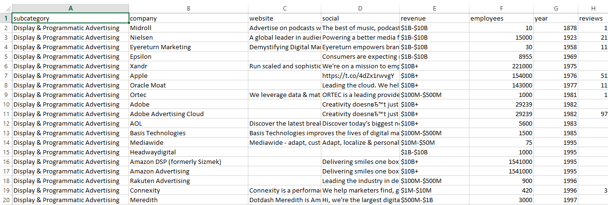

# MartechMap Web Scraper

A headless data extractor for [martechmap.com](https://martechmap.com/int_supergraphic), built with Python and Selenium.  
It logs in, scrolls the interactive supergraphic, collects company info from tooltips, and saves it to a CSV file.

## ✅ Features

- 🔐 Auto-login with `.env` credentials  
- 📊 Extracts:
  - Subcategory
  - Company name
  - Website
  - Twitter
  - Revenue
  - Employees
  - Year
  - Reviews
  - Rating
  - Source
- 🖱️ Hover simulation to capture dynamic tooltip content
- 💾 Outputs clean `vendors.csv` file

## 📦 Requirements

- Python 3.10+
- Google Chrome
- ChromeDriver (matching your Chrome version)

## 🛠️ Setup

1. Clone this repo:
   open cmd
   git clone https://github.com/yourname/martechmap-scraper.git
   cd martechmap-scraper

2. Add your credentials to config.env:
    EMAIL=your_email@example.com
    PASSWORD=your_password

3. Install dependencies: 
    pip install -r requirements.txt

4. Run the script:
    python main.py

Output:
    After completion, a file named vendors.csv will be created with structured company data.
    

## Notes ##
    Make sure your login is valid.

    This script simulates user actions, so keep the UI stable during execution.
    
    If scraping fails, try increasing scroll time or add random delays.
